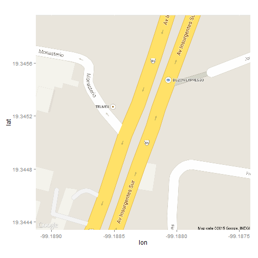

### Introducción al formato R Markdown

Ejemplo elaborado en Mon Jan 19 16:39:10 2015.


```r
library(ggmap)
```

```
## Warning: package 'ggmap' was built under R version 3.0.3
```

```
## Loading required package: ggplot2
```

```
## Warning: package 'ggplot2' was built under R version 3.0.3
```


```r
# Llenar información (sólo lo que está entre "").
clave.unica <- rep("142658",3)
# 1: Si es mixto, 0: no lo es.
es.mixto <- c(universidad = 1, preparatoria = 1, secundaria = 1)
# Llenar con la dirección.
universidad <- geocode("ITAM")
preparatoria <- geocode("Escuela Moderna Americana")
secundaria <- geocode("Escuela Moderna Americana")
# Generamos la información
educacion <- rbind(universidad, preparatoria, secundaria)
educacion <- cbind(clave.unica, es.mixto, educacion)
```


```r
limites <- make_bbox(lon, lat, educacion, f = 0.7)
mapa <- get_map(location = limites, 
                maptype = "roadmap", 
                source = "google")
```


```
## Warning: Removed 3 rows containing missing values (geom_point).
```

 
